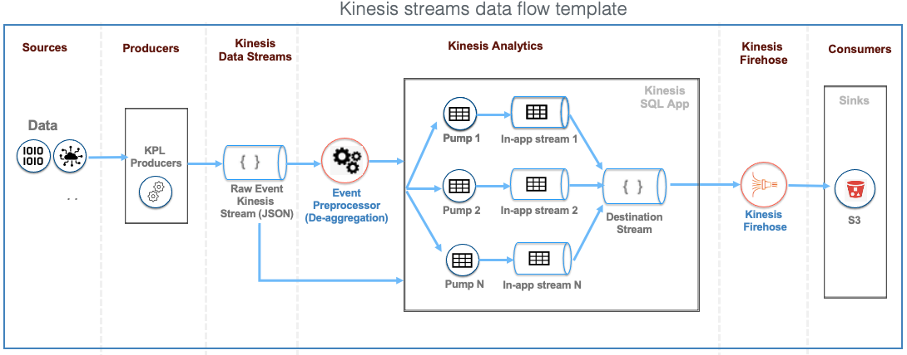

# streaming-analytics

This project sets up the starter AWS infrastructure for Kinesis streaming for the Transaction Log and Callback use case. The templates however can be adapted to fit many different use-cases.

## Record aggregation

Records are produced via KPL (Kinesis Producer Library) will be aggregated if the `recordMaxBufferedTime` property is set. If this is the case, or if you know the records are aggregated, please complete the setup for the deaggregator processor. Details below

If records are not aggregated, you can skip the preprocessor set up. When launching the Kinesis App stack template, set the `SourceRecordsAggregation` option to `false`

NOTE: The de-aggregation operation returns a no-op if records are not aggregated. A stream with non-aggregated records will still function correctly with de-aggregation enabled

**`PreProcessors`**

A preprocessor is a lambda function that de-aggregates KPL records. There are 2 of them in this repository and can be found at the root of the `ks-preprocessor` directory
1. `standard-preprocessor.py` - This function is provided by AWS and has been copied as-is from here: https://github.com/amazon-archives/serverless-app-examples/tree/master/python/kinesis-analytics-process-kpl-record
2. `transaction-callback-preprocessor.py` - This is a modification of the standard processor. It flattens Json key-value lists in the TransactionLog and Callback messages into objects. Kinesis cannot process deeply nested structures. This preparation is important because it surfaces dataa so that it can be easily correlated and merged


Dependencies were added manually by navigating into `/<..>/ks-preprocessor` and running this command from inside the directory:

```
pip install -r requirements.txt -t ./

```

Create a Zip file:

```
zip -r ks-preprocessor.zip .

```

The standard lambda function can also be deployed (and altered) manually via the Kinesis Application wizard (by selecting a Lambda template)

The standard preprocessor will work in most cases. Setting it up once will cover most scenarios. However, some cases (such as joining or corelating records, very complex messages) may have specific preprocessing requirements. In this case, extend and deploy the preprocessor functions as appropriate

To deploy a preprocessor, configure the `Handler` property of the `preprocessor.yaml` template with the desired function. The pattern is `Handler: <file>.<handler>`. 
For instance: `Handler: transaction-callback-preprocessor.lambda_handler`


**`AWS Cloudformation Templates`**

1. `analytics_bucket.yaml` - Stack template that creates an S3 bucket which will be used to store the output of Kinesis Analytics processing
2. `code-bucket.yaml` - Stack template that creates an S3 bucket for holding the `preprocessor` archive (zip). The zip file is created by packing the contents of the `ks-preprocessor` directory and uploading it to S3 (see the preprocessor section above)
3. `input-stream.yaml` - Stack template that creates a Kinesis Data Stream. Use this template to create data streams for raw KPL Records. Careful sizing considerations need to be made before deploying this stack. Sizing affects throughput (if underprovisioned, throughput is throttled and extra messages will be rejected) and cost. Data streams CANNOT be resized after creation.
4. `preprocessor.yaml` - Stack template that creates a lambda preprocessor function. The function is created from the Zip file contained in the S3 bucket from `code-bucket.yaml`.
5. `streaming-transaction-callback-with-corelate-app.yaml` - Stack template that creates a Kinesis Analytics application. This template contains basic aggregation (SQL application) for a single use case (TransactionLog and Callback). It also creates a Kinesis Firehose stream for writing to S3. Extend this template to create different applcations for different processing and output. 

### Running the templates

The templates are highly interdependent. Some stacks use the Outputs of existing stacks and hence those stacks must be run first. See below for dependence graph

WITH RECORD AGGREGATION

```

    analytics_bucket.yaml --> code-bucket.yaml
                                              \
                                               \
                                                input-stream.yaml --> preprocessor.yaml --> streaming-transaction-callback-with-corelate-app.yaml
                                               /
                                              /
    code-bucket.yaml --> analytics_bucket.yaml

```

NO RECORD AGGREGATION

Note: Set the `SourceRecordsAggregation` option to `false` when executing the `streaming-transaction-callback-with-corelate-app.yaml` template

```

    analytics_bucket.yaml --> code-bucket.yaml
                                              \
                                               \
                                                input-stream.yaml --> streaming-transaction-callback-with-corelate-app.yaml
                                               /
                                              /
    code-bucket.yaml --> analytics_bucket.yaml

```

Please use relevant and easy-to-remember values for the fields. These values are used to link stacks together via Output values

1. ProjectName - Use a common name so that it is easy to identify and related all resources created for a project / initiative. Add tags for easy management

2. StackName - Use a value that gives a general description of function of the stack. The stack name is used to prefix output values for the stack `{StackName}:InputStream`

Apply due diligence when populating the fields. Typos or non-existent resources will lead to failures during creation. Cloudformation is difficult to debug in the best of circumstances. Tagging and adopting a proper naming strategy with resources helps a lot with troubleshooting

### Test the Lambda preprocessor

Use the `test/transaction-callback-Record.json` file to check that the preprocessor has been created correctly. Click `Test` on the Lambda Console to create a test and copy the contents of the file into the payload. If successful, the Execution tab should show two records processed successfully

### Validate the application

If successfully created, the Analytics Application will comprise these elements:

1. Source - Streaming data source that reads data from a raw Kinesis data stream, an in-application stream and lambda preprocessor if de-aggregation is enabled.

2. Real-time analytics - A Kinesis SQL application with in-application streams, destination stream(s) and pumps

3. Destination - A firehose delivery stream to S3

### Data flow



### Running the application

In the Kinesis Data Analytics applications console, select your application and click `Run`.
